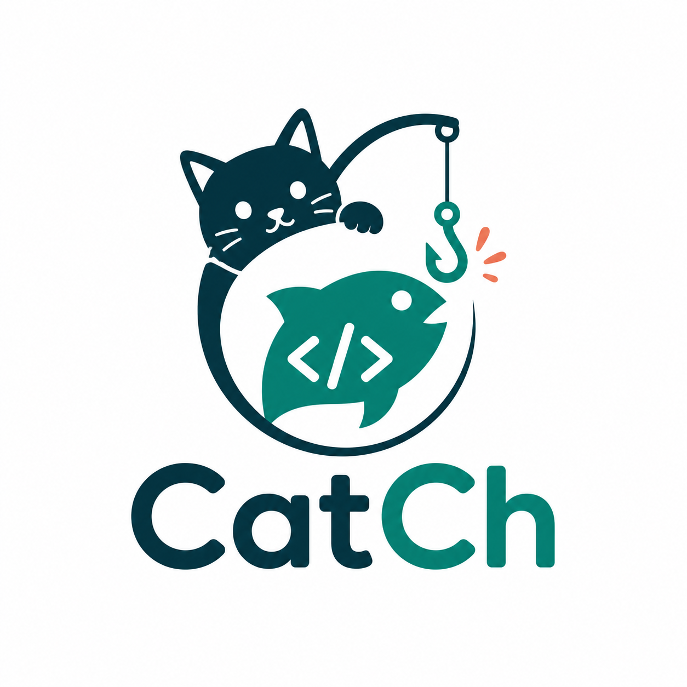

# CatCh

<p align="center">
  
</p>

[](https://github.com/JonasChenJusFox/CatCh/actions/workflows/game-service.yml)
[](https://github.com/JonasChenJusFox/CatCh/actions/workflows/grader-service.yml)
[](https://github.com/JonasChenJusFox/CatCh/actions/workflows/auth-service.yml)
[](https://github.com/JonasChenJusFox/CatCh/actions/workflows/teacher-service.yml)
[](https://github.com/JonasChenJusFox/CatCh/actions/workflows/integration.yml)
[](https://github.com/JonasChenJusFox/CatCh/actions/workflows/frontend-app.yml)

CatCh is a full-stack, gamified programming practice platform that turns coding exercises into a fishing and collection game. Students solve Python problems to earn fishing chances, catch fish with different rarity tiers, sell or list fish on a marketplace, decorate an aquarium, and compete on token and collection leaderboards. Teachers can create ponds, manage problems, and assign practice sets without participating in the student economy.

This repository is my polished portfolio version of the project. It emphasizes production-style service boundaries, containerized local development, CI checks, seeded demo data, JWT-based authentication, and a React interface that ties the learning loop and game economy together.

## Demo

Live app: [https://catch-bpp85.ondigitalocean.app](https://catch-bpp85.ondigitalocean.app)

| Component | URL |
|---|---|
| Web app | [CatCh live app](https://catch-bpp85.ondigitalocean.app) |
| Game API | [game-service](https://catch-bpp85.ondigitalocean.app/catch-game-service) |
| Grader API | [grader-service](https://catch-bpp85.ondigitalocean.app/catch-grader-service) |
| Auth API | [auth-service](https://catch-bpp85.ondigitalocean.app/catch-auth-service) |
| Teacher API | [teacher-service](https://catch-bpp85.ondigitalocean.app/catch-teacher-service) |

## Highlights

- Role-based experience for students and teachers, backed by username/password authentication and JWT verification.
- Coding practice loop with starter code, hidden tests, grading feedback, progress tracking, and fishing rewards.
- Sandboxed grading service with runtime timeout, process limits, read-only container settings, and isolated temporary storage.
- Fish inventory, rarity-driven catch mechanics, direct selling, marketplace listing and buying, aquariums, and leaderboards.
- Teacher tools for public/private ponds, problem CRUD, assignments, and invite-based private pond access.
- MongoDB-backed persistence with auto-seeded coding problems, fish species, and fish image assets for a quick demo.
- Docker Compose setup for the full stack and GitHub Actions workflows for backend tests, frontend build checks, image delivery, and deployment.

## Recent Updates

- Added the CatCh logo to the app chrome and README.
- Added email-code login with SMTP delivery, console fallback for offline demos, and `/auth/smtp/diagnostics` for checking SMTP setup without sending mail.
- Tightened responsive layouts for marketplace rows and leaderboard entries so long usernames, prices, and token totals do not overflow cards on narrower screens.

## Architecture

| Subsystem | Responsibility | Tech | Local Port |
|---|---|---|---|
| `frontend/app` | React web client served by Nginx in Docker | React, Vite, Nginx | 3000 |
| `auth-service` | Sign-up, login, password reset, logout, JWT validation and refresh | FastAPI, MongoDB | 8002 |
| `game-service` | Problems, submissions, fishing, inventory, marketplace, ponds, leaderboards | FastAPI, MongoDB | 8000 |
| `grader-service` | Executes submitted Python code against tests in an isolated service | FastAPI | 8001 |
| `teacher-service` | Teacher-facing pond and problem management APIs | FastAPI, MongoDB | 8003 |
| `integration` | Service discovery and frontend configuration endpoints | FastAPI | 8004 |
| `mongo` | Shared local persistence layer | MongoDB 7 | 27017 |

The services communicate through explicit environment-configured URLs. In local Docker, each backend uses the Compose service network; in deployment, the same configuration points at DigitalOcean App Platform component routes.

## Tech Stack

- Frontend: React, Vite, CSS, Nginx
- Backend: FastAPI, Pydantic, Uvicorn, Pipenv
- Database: MongoDB
- Auth: PBKDF2 password hashing, JWT access tokens
- Infrastructure: Docker, Docker Compose, Docker Hub, DigitalOcean App Platform
- Quality: pytest, coverage gates, Black, Pylint, GitHub Actions

## Quick Start

```bash
git clone https://github.com/JonasChenJusFox/CatCh.git
cd CatCh
cp .env.example .env
```

For local Docker usage, keep the default Compose-friendly values or set these frontend API URLs in `.env`:

```env
VITE_GAME_SERVICE_URL=http://localhost:8000
VITE_AUTH_SERVICE_URL=http://localhost:8002
VITE_TEACHER_SERVICE_URL=http://localhost:8003
VITE_INTEGRATION_SERVICE_URL=http://localhost:8004
```

Then build and run the full stack:

```bash
docker compose up --build
```

Open [http://localhost:3000](http://localhost:3000).

To stop the stack:

```bash
docker compose down
docker compose down -v
```

The second command also removes the MongoDB volume, which is useful when you want a clean reseed.

## Local Accounts

The app supports four auth flows from the first screen:

- `Sign Up` creates either a student account or a teacher account.
- `Log In` authenticates with username and password.
- `Email Code` sends a verification code to an email address, then signs in with the code and selected role.
- `Forgot` resets a password when the username and email match.

Passwords are hashed before storage. JWTs carry the user's id, username, email, role, permissions, and expiration so the rest of the app can authorize requests without re-checking credentials on every call.

Email-code login requires the SMTP variables in `.env` to point at a working SMTP account. In local Docker, use the `Email Code` tab on [http://localhost:3000](http://localhost:3000), choose `Kitten` or `Cat`, send the code, then submit the code received by email.

For real email delivery, `.env` must contain real values for:

- `VERIFICATION_CODE_DELIVERY=smtp`
- `VERIFICATION_CODE_PEPPER`: a long random secret, for example from `openssl rand -hex 32`
- `SMTP_HOST`: for Gmail, `smtp.gmail.com`
- `SMTP_PORT`: for Gmail STARTTLS, `587`
- `SMTP_USERNAME`: the sender Gmail address
- `SMTP_PASSWORD`: a Gmail App Password generated for that exact account
- `SMTP_FROM_EMAIL`: the sender Gmail address
- `SMTP_REPLY_TO`: the reply-to Gmail address

After changing these values, recreate the auth container:

```bash
docker compose up -d --build --force-recreate auth-service
```

To diagnose real SMTP delivery without sending an email:

```bash
curl http://localhost:8002/auth/smtp/diagnostics
```

If `error_stage` is `tcp`, the container cannot reach the SMTP server or port. If `error_stage` is `auth`, the SMTP username or app password is rejected.

## Seed Data

The `data/` directory contains demo content used by `game-service`:

- `judgeable_problems.json`: 74 Python coding problems with starter code, hidden tests, and reference solutions.
- `fish_species.json`: 50 fish species with rarity, price, and sell-value metadata.
- `catch.png`: CatCh logo used by the README and frontend.
- `fish_images/`: PNG assets served by the game service at `/fish_images/<species_id>.png`.

When `DB_BACKEND=mongo` and the target collections are empty, `game-service` seeds this content automatically on startup.

## Development

Docker is the fastest way to run the whole application. For service-by-service development, run a backend from its own directory:

```bash
cd <service-name>
pipenv install --dev
pipenv run uvicorn app.main:app --reload --port <port>
```

Run the frontend Vite dev server separately:

```bash
cd frontend/app
npm install
npm run dev
```

The Vite dev server runs on [http://localhost:5173](http://localhost:5173). The Dockerized frontend runs on [http://localhost:3000](http://localhost:3000).

## Environment Variables

Copy `.env.example` to `.env` before the first run. The most important values are:

| Variable | Used By | Purpose |
|---|---|---|
| `JWT_SECRET`, `JWT_ALGORITHM`, `JWT_EXPIRY_HOURS` | `auth-service` | JWT signing and expiry configuration |
| `PASSWORD_HASH_ITERATIONS` | `auth-service` | PBKDF2 hashing strength |
| `VERIFICATION_CODE_LENGTH`, `VERIFICATION_CODE_TTL_MINUTES`, `VERIFICATION_CODE_MAX_ATTEMPTS`, `VERIFICATION_CODE_PEPPER`, `VERIFICATION_CODE_DELIVERY` | `auth-service` | Email-code login length, expiry, attempt limit, hash pepper, and delivery mode |
| `SMTP_HOST`, `SMTP_PORT`, `SMTP_USERNAME`, `SMTP_PASSWORD`, `SMTP_FROM_EMAIL`, `SMTP_FROM_NAME`, `SMTP_REPLY_TO`, `SMTP_USE_TLS`, `SMTP_TIMEOUT_SECONDS` | `auth-service` | SMTP-only verification-code email delivery |
| `GRADER_SERVICE_URL`, `GAME_SERVICE_URL`, `TEACHER_SERVICE_URL`, `AUTH_SERVICE_URL` | backend services | Service-to-service URLs |
| `VITE_GAME_SERVICE_URL`, `VITE_AUTH_SERVICE_URL`, `VITE_TEACHER_SERVICE_URL`, `VITE_INTEGRATION_SERVICE_URL` | `frontend/app` | API URLs embedded in the React build |
| `DB_BACKEND` | `game-service` | `mongo` for persisted local demo data or `mock` for in-memory smoke tests |
| `MONGO_URL`, `MONGO_DB`, `MONGO_INITDB_ROOT_PASSWORD` | Mongo-backed services | Database connection and local container credentials |
| `ALLOWED_ORIGINS` | backend services | CORS allow-list |
| `GRADER_TIMEOUT_SECONDS` | `grader-service` | Wall-clock timeout per grading request |
| `WEB_APP_PORT` | `frontend/app` | Host port mapped to the Nginx container |
| `LOG_LEVEL` | backend services | Python logging level |

## API Examples

Create an account:

```bash
curl -X POST http://localhost:8002/auth/signup \
  -H "Content-Type: application/json" \
  -d '{"username":"JJ","email":"jj@example.com","password":"password123","role":"cat"}'
```

Log in:

```bash
curl -X POST http://localhost:8002/auth/login \
  -H "Content-Type: application/json" \
  -d '{"username":"JJ","password":"password123"}'
```

Request an email verification code:

```bash
curl -X POST http://localhost:8002/auth/verification-code/request \
  -H "Content-Type: application/json" \
  -d '{"email":"jj@example.com","role":"kitten"}'
```

For offline local demos, set `VERIFICATION_CODE_DELIVERY=console` in `.env` and recreate `auth-service`. The API returns a `debug_code`, and the frontend shows it as `Local demo code: ...` instead of sending SMTP mail.

Log in with an email verification code:

```bash
curl -X POST http://localhost:8002/auth/verification-code/login \
  -H "Content-Type: application/json" \
  -d '{"email":"jj@example.com","code":"123456","role":"kitten"}'
```

Check a service:

```bash
curl http://localhost:8000/health
```

## Testing

Each Python service includes formatting, linting, and coverage checks:

```bash
cd <service-name>
pipenv run python -m black --check .
pipenv run python -m pylint app tests
pipenv run pytest --cov=app --cov-report=term-missing --cov-fail-under=80
```

Frontend build check:

```bash
cd frontend/app
npm run build
```

## Deploying Updates

Production deploys are driven by the GitHub Actions workflows in `.github/workflows/`. On a push to `main` or `master`, each changed service workflow builds its Docker image, publishes it to Docker Hub, and, when deployment is enabled, asks DigitalOcean App Platform to create a new deployment.

Before deploying, make sure these GitHub repository settings exist:

- Secrets: `DOCKERHUB_USERNAME`, `DOCKERHUB_TOKEN`, `DIGITALOCEAN_ACCESS_TOKEN`, `DIGITALOCEAN_APP_ID`
- Variable: `ENABLE_DO_DEPLOY=true`

Make sure the DigitalOcean App environment contains the real production values:

- `MONGO_URL` and `MONGO_DB` for Atlas
- `JWT_SECRET`, `VERIFICATION_CODE_PEPPER`, and `VERIFICATION_CODE_DELIVERY=smtp`
- `SMTP_HOST`, `SMTP_PORT`, `SMTP_USERNAME`, `SMTP_PASSWORD`, `SMTP_FROM_EMAIL`, `SMTP_REPLY_TO`, `SMTP_USE_TLS`, `SMTP_TIMEOUT_SECONDS`
- Frontend API URLs or component routes matching the deployed App Platform services

Deploy flow:

```bash
git status
git add README.md .env.example docker-compose.yml \
  auth-service/app/main.py auth-service/tests/test_auth.py \
  frontend/app/src/App.jsx frontend/app/src/styles.css frontend/app/src/assets/catch.png \
  data/README.md data/catch.png data/judgeable_problems.json data/problem_set_raw.csv \
  game-service/README.md game-service/tests/test_mock_repo.py game-service/tests/test_quiz.py \
  scripts/README.md
git commit -m "Polish auth, problem set, and responsive UI"
git push origin main
```

Do not commit `.env` or local scratch datasets such as `data/problems.json`.

Then open GitHub Actions and wait for the relevant workflows to pass: `frontend-app`, `auth-service`, `game-service`, and any other service touched by the commit. The final deploy step should run `doctl apps create-deployment ... --wait`.

After DigitalOcean finishes deploying, verify:

```bash
curl https://catch-bpp85.ondigitalocean.app/catch-auth-service/health
curl https://catch-bpp85.ondigitalocean.app/catch-auth-service/auth/smtp/diagnostics
curl https://catch-bpp85.ondigitalocean.app/catch-game-service/health
```

Then hard-refresh the live app and check that email-code login works, marketplace and leaderboard cards fit at smaller widths, and the coding practice problem list loads normally. If an existing production database still has older seeded demo content, restart `game-service` after the new image deploys so the static problem set is re-synced.

## Repository Layout

```text
.
├── auth-service/      # Authentication and JWT lifecycle
├── data/              # Seeded problems, fish metadata, and images
├── frontend/app/      # React client
├── game-service/      # Core game, quiz, marketplace, pond, and leaderboard APIs
├── grader-service/    # Isolated Python grading API
├── integration/       # Service metadata and frontend config API
├── teacher-service/   # Teacher pond and problem management
└── docker-compose.yml # Full local stack
```

## Author

Built and maintained by [Jonas Chen](https://github.com/JonasChenJusFox).
